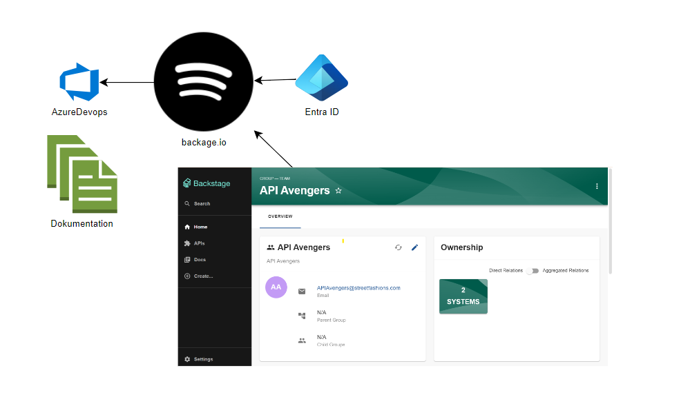

# Backstage Setup and Deployment Guide

This guide will walk you through setting up and deploying a Backstage application using Azure DevOps, Entra ID, Docker, and Kubernetes.



## Prerequisites

- **Entra ID**: See a manifest for an app registration in [`./examples/entra-id-app-reg-manifest.json`] "$HOME//backstage/hello-backstage/examples/entra-id-app-reg-manifest.json").
- **Azure DevOps**: In the organization settings, make sure to add Code Search.

## 1. Install Dependencies

Install the necessary dependencies for Azure DevOps and Entra ID:

```bash
yarn --cwd packages/backend add @backstage/plugin-catalog-backend-module-azure
yarn --cwd packages/backend add @backstage/plugin-auth-backend-module-microsoft-provider
yarn --cwd packages/backend add pg
```

After adding packages, rebuild the backend:

```bash
yarn run build:backend
```

## 2. Local Development Configuration

When running `yarn dev`, the configuration file `app-config.local.yaml` will be used. The local development setup connects to a local PostgreSQL database. You can start a local PostgreSQL container with:

```bash
./dev-postgres.sh
```

## 3. Running Local Development

First, start a local PostgreSQL container:

```bash
./dev-postgres.sh
```

Then run:

```bash
yarn dev
```

## 4. Source Code Overview

The file [`packages/backend/src/index.ts`] "$HOME//backstage/hello-backstage/packages/backend/src/index.ts") loads all plugins and customizations:
- Entra ID Auth plugin
- Azure DevOps Catalog plugin
- Domain policy for Entra ID users that allows one specific domain, implemented in [`packages/backend/src/allowedDomainPlugin.ts`] "$HOME//backstage/hello-backstage/packages/backend/src/allowedDomainPlugin.ts"). The plugin reads `auth.allowedDomain`.

## 5. Building the Docker Image

Compile the backend and frontend in the [`./packages`] "$HOME//backstage/hello-backstage/packages") folder:

```bash
cd ~/path-to-repo/
yarn run build:all
yarn run build-image
```

Alternatively, you can remove the existing Docker image and rebuild:

```bash
docker rmi -f backstage:latest
yarn run build:all
yarn run build-image
```

The Dockerfile is located in [`./packages/backend/Dockerfile`] "$HOME//backstage/hello-backstage/packages/backend/Dockerfile").

## 6. Configuration with Environment Variables

To use environment variables in configuration files, define them with the prefix `APP_CONFIG_`. For example, to replace `app.title`:

```bash
APP_CONFIG_app_title=ohhi yarn dev
```

You can also use `${VAR_NAME}` syntax.

## 7. Configuration in Kubernetes

For configuration variables such as PostgreSQL, use templated variables:

```yaml
backend:
  database:
    client: pg
    connection:
      host: ${POSTGRES_SERVICE_HOST}
      port: ${POSTGRES_SERVICE_PORT}
      user: ${POSTGRES_USER}
      password: ${POSTGRES_PASSWORD}
```

## Starting the Container

Run the container:

```bash
docker run -it backstage
```

## Intermediate Step: Docker Compose

Use `docker-compose.dev.yaml` for an intermediate step before Kubernetes:

```bash
docker-compose -f docker-compose.yaml up
```

Access the application at [http://localhost:7007/](http://localhost:7007/).

## Pushing the Built Image to Azure Container Registry (ACR)

Login to Azure and push the image:

```bash
az login
az acr create -g aks -n acr2928181 --sku Standard
az acr login -n acr2928181
docker tag backstage:latest acrXXXX.azurecr.io/my-backstage:latest
docker push acrXXXX.azurecr.io/my-backstage:latest
```

Push the PostgreSQL image:

```bash
docker image pull bitnami/postgresql:15.4.0-debian-11-r10
docker tag bitnami/postgresql:15.4.0-debian-11-r10 acrXXXX.azurecr.io/bitnami/postgresql:15.4.0-debian-11-r10
docker push acrXXXX.azurecr.io/bitnami/postgresql:15.4.0-debian-11-r10
az acr update --name acr2928181 --anonymous-pull-enabled
```

## Deploy to Local Kubernetes from ACR

Create a Kubernetes cluster and deploy:

```bash
kind create cluster
kubectl create namespace backstage
kubectl apply -f kubernetes/postgres-secret.yaml
kubectl apply -f kubernetes/backstage-secret.yaml
helm repo add backstage https://backstage.github.io/backstage
helm show values backstage/backstage
helm install --generate-name backstage/backstage -f kubernetes/values.yaml
```

Verify environment variables:

```bash
kubectl exec -it <pod-name> -- env | grep POSTGRES_
```

## Deploy to AKS from ACR

Create an AKS cluster:

```bash
az aks create --resource-group backstage --name backstage --node-count 1 --generate-ssh-keys
```

Connect to AKS:

```bash
az aks get-credentials --resource-group backstage --name backstage
```

Install Ingress NGINX:

```bash
helm repo add ingress-nginx https://kubernetes.github.io/ingress-nginx
helm install ingress-nginx ingress-nginx/ingress-nginx
```

Deploy the Helm chart:

```bash
kubectl create namespace backstage
kubectl apply -f kubernetes/postgres-secret.yaml
helm install backstage backstage/backstage -f backstage-values.yaml
```

## Verifying the Setup

Port-forward to access the Backstage application:

```bash
kubectl port-forward <pod-name> 7007:7007
```

Login to the PostgreSQL shell to verify the database:

```bash
kubectl exec -it <postgres-pod-name> -- psql -U postgres
```

List the databases:

```sql
\l
```
 